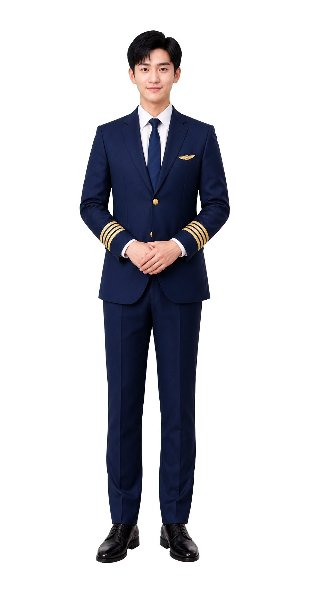

# 星航数伴 StarFlight · 民航文旅 3D 数字人导览助手

> 面向机场 / 航司 / 景区的「AI 分身讲解员」——让服务从"查一下"变成"聊一聊"。



---

## ✨ 产品亮点（30 秒速览）

1. 🗣️ **真能聊的数字人**：3D 数字人 + 大模型（Qwen）+ 语音合成，开口讲解、听懂提问、自然应答，不是文本框机器人。
2. 📚 **回答有依据**：内置民航 + 文旅领域知识库（RAG 检索增强），机场服务流程、景点信息等**有据可依地回答**，不凭空编造。
3. 💾 **记得住上下文**：多轮对话 + 历史持久化（SQLite），用户说过的话系统记得，对话自然连贯。
4. 🎭 **可交互 Demo**：React 实时界面 + 数字人动画驱动，可离线 Mock 演示（无 API Key 也能跑通全流程）。
5. 📦 **开箱即用**：Windows 一键启动脚本 + 完整部署手册（含 3D 引擎接入指南）。

---

## 💡 一句话介绍

给民航与文旅场景配置一位**24 小时在线、会说会听、熟悉本地服务**的数字人导览员——旅客/游客开口提问，数字人基于内部知识库实时解答。

---

## 🎯 为什么做它

### 用户痛点

| 场景 | 现状问题 |
|---|---|
| 机场 / 航站楼 | 问询台人力有限、高峰排队；旅客反复问"托运在几楼""登机口怎么走" |
| 航司服务 | 服务号里的机器人"答非所问"，只能走固定菜单 |
| 景区 / 文旅 | 导览内容单一，缺少个性化讲解；旺季讲解员供给不足 |

### 目标用户与使用场景

| 用户 | 使用场景 |
|---|---|
| 机场旅客 | 在大屏/服务台前开口问乘机流程、航站楼设施 |
| 景区游客 | 询问景点历史、游览路线、餐饮购物推荐 |
| 航司 / 场馆运营方 | 部署数字人自助终端，降低人力咨询成本、提升服务形象 |

---

## 🧭 产品方案

### 核心流程

```
游客开口提问
   │  ASR（语音识别）
   ▼
数字人理解意图（大模型多轮对话）
   │
   ├─► 需要内部资料？ ──► RAG 检索知识库 ──► 带依据的回答
   │
   ▼
语音合成（TTS）+ 3D 数字人开口应答
   │
   ▼
对话历史落库（SQLite），下一轮上下文自动衔接
```

### 功能 → 用户价值

| 功能 | 用户获得的价值 |
|---|---|
| 民航/文旅领域知识库问答 | 问"怎么看登机牌"有标准答案，不靠大模型瞎编 |
| 多轮对话记忆 | 聊到一半被打断，回来还能接上话茬 |
| 数字人语音讲解 | 比看文字更直观、更有陪伴感，适合公共大屏场景 |
| 离线 Mock 模式 | 无网络也能演示核心体验，便于产品评审/路演 |

---

## 🤔 我的产品决策（关键取舍）

1. **先打透一个垂直场景，不做通用助理。** 与其做一个什么都懂一点的大模型聊天框，不如让知识库围绕"民航文旅"这一个场景打磨——**垂直场景的数据质量，决定数字人"像不像人工智障"**。这是产品定位决策，而非技术炫技。
2. **把"多轮记忆"做成产品默认能力。** 咨询场景中用户常中途离开再回来；丢上下文等于重新开始，因此从第一版就把对话历史做进产品。
3. **用真实 API + Mock 双模式交付。** 面向评委/HR 演示时不能依赖外网 API 是否可用，所以设计了完整可跑的离线模式——**演示从不出事故**，这是做 to-B 产品的基本素养。
4. **3D 引擎作为可插拔组件。** 3D 动画消耗算力且安装重，因此把"数字人外观"与"对话大脑"解耦：先用好懂的语言交流，外观可后续更换。

---

## 📈 数据成效（可核实）

| 维度 | 数据 |
|---|---|
| 产品完整性 | 前后端全栈可运行：React 18 + TS 前端 · Flask + LangChain 后端 |
| 知识库 | 民航/文旅场景化知识库，RAG 检索（向量相似度阈值过滤 + 关键词兜底） |
| 记忆能力 | SQLite 持久化多轮对话，会话历史接口可回溯 |
| 鲁棒性 | 无 API Key / 网络异常时自动降级离线模式，服务不中断 |
| 交付文档 | 产品部署和使用手册 · 产品总体设计文档（docs/ 内） |

> 未虚构用户数据；如需更硬的量化指标（如对话轮数、知识库条目数），可在上线试用后补充真实统计。

---

## 🔄 复盘 & 迭代规划

**复盘**
- ✅ 做对了：垂直场景 + RAG + 记忆闭环的组合，demo 完整度高、可讲性强的产品叙事。
- ⚠️ 可改进：3D 引擎安装体积大（约 840MB），拉高了本地体验门槛；应提供 Web 轻量渲染替代。
- ⚠️ 可改进：知识库数据为人工整理，需建立内容运营流程保证长期更新。

**下一步**
- [ ] 补充 Web 端轻量 3D / Live2D 渲染，降低体验门槛
- [ ] 接入航司真实服务数据（航班动态、值机柜台）形成业务闭环
- [ ] 增加运营后台，让非技术运营人员维护知识库
- [ ] 埋点统计"问题解决率、多轮留存率"验证产品价值

---

<details>
<summary><b>⚙️ 技术栈与快速开始（能力佐证，点击展开）</b></summary>

### 技术栈

| 模块 | 技术 |
|---|---|
| 前端 | React 18 + TypeScript + Vite |
| 后端 | Flask + LangChain + SQLite |
| LLM / 语音 | 阿里 DashScope（Qwen / TTS）|
| 3D 引擎 | OpenAvatarChat（Unity + WebSocket，外部组件）|
| RAG | FAISS 向量库 + DashScope Embedding + 关键词兜底 |

### 快速开始

```bash
git clone https://github.com/lakeart/starflight-digital-human.git
cd starflight-digital-human
# 后端
cd backend && pip install -r requirements.txt
cp .env.example .env   # CHAT_PROVIDER=mock 可离线运行
# 前端（另开终端）
npm install && npm run dev
```

完整部署（含 3D 引擎）见 `docs/产品部署和使用手册.pdf`。

### 第三方组件

| 组件 | 用途 | License |
|---|---|---|
| OpenAvatarChat | 3D 数字人引擎 | Apache 2.0 |
| LangChain | RAG 管线 | MIT |
| DashScope API | LLM + TTS | 商业 API |
| React / Flask | 前后端框架 | MIT / BSD-3 |

</details>

---

## 🔗 链接

- Gitee：https://gitee.com/lakeart/starflight-digital-human
- GitHub：https://github.com/lakeart/starflight-digital-human
- 产品文档：`docs/`（部署手册 / 总体设计）

*一个把"民航文旅服务"做成「能对话、有依据、记得住」的数字人产品。*
